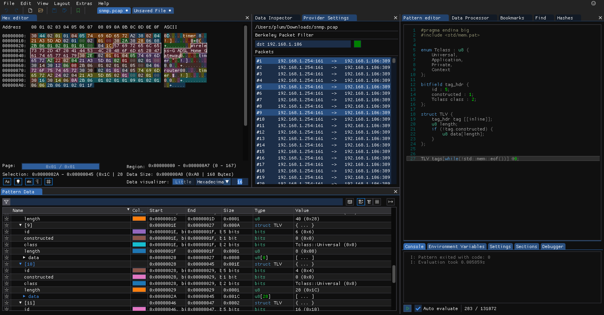

# ImHex Packet Capture Plugin 

This plugin adds a provider for parsing pcap files. It allows for binary analysis on packet contents and supports automatic stripping of ethernet, IP, TCP, and UDP headers. It also supports Berkly Packet Filters and message reassembly via selecting multiple packets.

## Building

Building a plugin works similarly to building ImHex. Make sure you have all dependencies installed that are necessary to build ImHex itself. Afterwards simply use cmake in the top level of this repository to build libimhex and the plugin. Consult the ImHex README.md for a more in-depth guide on how to compile ImHex using cmake.

When installing, make sure to place the plugin file in the ImHex `plugins` folder and move the discord sdk libraries to a location where ImHex picks them up (next to the executable, in a system library folder, etc)
